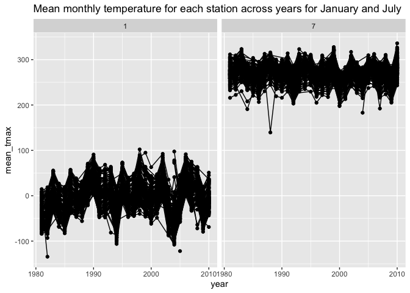

p8105_hw3_am6594
================
Alice Mao
2024-10-17

``` r
# load the libraries
library(tidyverse)
```

    ## ── Attaching core tidyverse packages ──────────────────────── tidyverse 2.0.0 ──
    ## ✔ dplyr     1.1.4     ✔ readr     2.1.5
    ## ✔ forcats   1.0.0     ✔ stringr   1.5.1
    ## ✔ ggplot2   3.5.1     ✔ tibble    3.2.1
    ## ✔ lubridate 1.9.3     ✔ tidyr     1.3.1
    ## ✔ purrr     1.0.2     
    ## ── Conflicts ────────────────────────────────────────── tidyverse_conflicts() ──
    ## ✖ dplyr::filter() masks stats::filter()
    ## ✖ dplyr::lag()    masks stats::lag()
    ## ℹ Use the conflicted package (<http://conflicted.r-lib.org/>) to force all conflicts to become errors

``` r
library(ggridges)
library(patchwork)
library(p8105.datasets)
library(dplyr)
```

# Problem 1

``` r
# load the data
data("ny_noaa")

# clean the data
ny_noaa %>% 
  count(snow) %>%
  arrange(desc(n))
```

    ## # A tibble: 282 × 2
    ##     snow       n
    ##    <int>   <int>
    ##  1     0 2008508
    ##  2    NA  381221
    ##  3    25   31022
    ##  4    13   23095
    ##  5    51   18274
    ##  6    76   10173
    ##  7     8    9962
    ##  8     5    9748
    ##  9    38    9197
    ## 10     3    8790
    ## # ℹ 272 more rows

``` r
# creating separate variables for year, month, and da
ny_noaa = 
  ny_noaa %>%
  separate(date, into = c("year", "month", "day"), convert = TRUE) %>% 
  mutate(
    tmax = as.numeric(tmax),
    tmin = as.numeric(tmin))
```

``` r
# create a two-panel plot showing the average max temperature in January and in July in each station across years
ny_noaa %>% 
  group_by(id, year, month) %>% 
  filter(month %in% c(1, 7)) %>% 
  summarize(mean_tmax = mean(tmax, na.rm = TRUE, color = id)) %>% 
  ggplot(aes(x = year, y = mean_tmax, group = id)) + geom_point() + geom_path() +
  facet_grid(~month) +
  labs(title = "Mean monthly temperature for each station across years for January and July")
```

    ## `summarise()` has grouped output by 'id', 'year'. You can override using the
    ## `.groups` argument.

    ## Warning: Removed 5970 rows containing missing values or values outside the scale range
    ## (`geom_point()`).

    ## Warning: Removed 5931 rows containing missing values or values outside the scale range
    ## (`geom_path()`).

<!-- -->

The plot shows relatively consistent mean monthly temperature trends
across years for both stations, with temperatures generally clustering
within expected ranges. However, there are clear outliers, especially in
Station 1, where temperatures dip below -100°C, which is highly
unrealistic and likely due to data errors or sensor issues. Station 7
shows fewer extreme outliers, but some points still fall outside the
expected range. Overall, the temperature patterns are stable, but the
presence of these outliers suggests the need for further investigation
into potential data anomalies.

# Problem 2

``` r
# load and tidy the data files
accel_data <- read_csv("data/nhanes_accel.csv") |> janitor::clean_names()
```

    ## Rows: 250 Columns: 1441
    ## ── Column specification ────────────────────────────────────────────────────────
    ## Delimiter: ","
    ## dbl (1441): SEQN, min1, min2, min3, min4, min5, min6, min7, min8, min9, min1...
    ## 
    ## ℹ Use `spec()` to retrieve the full column specification for this data.
    ## ℹ Specify the column types or set `show_col_types = FALSE` to quiet this message.

``` r
covar_data <- read_csv("data/nhanes_covar.csv", skip = 4, na = c("NA", ".", "")) |>
  janitor::clean_names()
```

    ## Rows: 250 Columns: 5
    ## ── Column specification ────────────────────────────────────────────────────────
    ## Delimiter: ","
    ## dbl (5): SEQN, sex, age, BMI, education
    ## 
    ## ℹ Use `spec()` to retrieve the full column specification for this data.
    ## ℹ Specify the column types or set `show_col_types = FALSE` to quiet this message.

``` r
# exclude participants less than 21 years of age
covar_data_clean <- covar_data %>%  filter(age >= 21)

# encode data with reasonable variable classes - sex
covar_data_clean$sex = factor(covar_data_clean$sex, levels = c("1", "2"), labels = c("Male", "Female"))

# encode data with reasonable variable classes - education levels
covar_data_clean$education = factor(covar_data_clean$education, levels = c("1", "2", "3"), labels = c("Less than high school", "High school equivalent", "More than high school"))

# merge data into one final datasets
merged_data <- inner_join(covar_data_clean, accel_data, by = "seqn")
```

``` r
# Produce a table for the number of men and women in each education category
merged_data %>%
  count(education, sex) %>%
  pivot_wider(names_from = sex, values_from = n) %>%
  knitr::kable(col.names = c("Education", "Male", "Female"),
               caption = "Number of Men and Women by Education Level")
```

| Education              | Male | Female |
|:-----------------------|-----:|-------:|
| Less than high school  |   28 |     29 |
| High school equivalent |   36 |     23 |
| More than high school  |   56 |     59 |

Number of Men and Women by Education Level

The table shows a fairly balanced distribution of men and women across
all education levels. In the “Less than high school” category, the
numbers are nearly equal for both genders. However, in the “High school
equivalent” group, there is a notable difference, with more men (36)
than women (23). In the “More than high school” category, women slightly
outnumber men.

``` r
# Create a visualization of the age distributions for men and women in each education category
merged_data %>%
  ggplot(aes(x = age, fill = sex)) +
  geom_histogram(bins = 20, position = "dodge") +
  facet_wrap(~education) +
  labs(title = "Age Distribution by Education and Sex", x = "Age", y = "Count")
```

<!-- -->

The bar plot shows that there is a gender balance in the “Less than high
school” and “More than high school” groups. The “High school equivalent”
group has more men. Older adults (above 60 years) appear evenly
distributed across all education levels, with higher education being
associated with a broader age range. Individuals with “More than high
school” education has the most counts.

``` r
# aggregate across minutes to create a total activity variable for each participant
total_activity_data <- merged_data %>%
  rowwise() %>%
  mutate(total_activity = sum(c_across(starts_with("min")), na.rm = TRUE)) %>%
  ungroup()

# Plot total activity vs age
total_activity_data %>%
  ggplot(aes(x = age, y = total_activity, color = sex)) +
  geom_point() +
  geom_smooth(method = "loess") +
  facet_wrap(~education) +
  labs(title = "Total Activity vs Age", x = "Age", y = "Total Activity")
```

    ## `geom_smooth()` using formula = 'y ~ x'

<!-- -->

The three panels correspond to different education levels: “Less than
high school,” “High school equivalent,” and “More than high school.”
Each panel also distinguishes between males and females using different
colored lines, with dots representing individual data points and shaded
areas indicating variability.

In the “Less than high school” group, there is a noticeable decline in
total activity as age increases, particularly after the age of 50.
Although both males and females exhibit this downward trend, females
appear to have slightly higher activity levels in younger ages.

For individuals with a “High school equivalent” education, total
activity appears to fluctuate across age groups. In younger age groups
(below 40), both males and females show relatively higher and more
variable levels of activity, but after age 40, there is a more
noticeable decrease in total activity for both sexes.

In the “More than high school” group, the pattern is relatively
consistent compared to the other education groups. Both males and
females show stable activity levels across different ages, with a slight
decline in total activity as age increases, after age 60. There is less
variability compared to the other education groups, and the activity
trends for males and females are closely aligned throughout most of the
age range.

``` r
# Reshape the activity data to long format
long_activity_data <- merged_data %>%
  pivot_longer(cols = starts_with("min"), 
               names_to = "minute", 
               values_to = "activity", 
               names_prefix = "min") %>%
  mutate(minute = as.numeric(minute),
         hour = floor((minute - 1) / 60))

# create a three-panel plot that shows the 24-hour activity time courses for each education level and use color to indicate sex
long_activity_data %>%
  group_by(education, sex, hour) %>%
  summarise(mean_activity = mean(activity, na.rm = TRUE)) %>%
  ggplot(aes(x = hour, y = mean_activity, color = sex)) +
  geom_line() +
  facet_wrap(~education) +
  labs(title = "24-Hour Activity by Education Level and Sex", 
       x = "Hour of Day", y = "Mean Activity")
```

    ## `summarise()` has grouped output by 'education', 'sex'. You can override using
    ## the `.groups` argument.

<!-- -->

This graph shows the mean activity levels of men and women throughout
the day, broken down by education level. Across all education levels,
the activity patterns are quite consistent between male and female, with
activity rising sharply in the morning, peaking around mid-day, and then
declining toward the evening. This daily cycle reflects typical
behavior, with people being more active during daylight hours and less
active at night.

# Problem 3

``` r
# Load the dataset
jan_2020 <- read_csv("data/citibike/Jan 2020 Citi.csv") |> janitor::clean_names()
```

    ## Rows: 12420 Columns: 7
    ## ── Column specification ────────────────────────────────────────────────────────
    ## Delimiter: ","
    ## chr (6): ride_id, rideable_type, weekdays, start_station_name, end_station_n...
    ## dbl (1): duration
    ## 
    ## ℹ Use `spec()` to retrieve the full column specification for this data.
    ## ℹ Specify the column types or set `show_col_types = FALSE` to quiet this message.

``` r
jan_2024 <- read_csv("data/citibike/Jan 2024 Citi.csv") |> janitor::clean_names()
```

    ## Rows: 18861 Columns: 7
    ## ── Column specification ────────────────────────────────────────────────────────
    ## Delimiter: ","
    ## chr (6): ride_id, rideable_type, weekdays, start_station_name, end_station_n...
    ## dbl (1): duration
    ## 
    ## ℹ Use `spec()` to retrieve the full column specification for this data.
    ## ℹ Specify the column types or set `show_col_types = FALSE` to quiet this message.

``` r
july_2020 <- read_csv("data/citibike/July 2020 Citi.csv") |> janitor::clean_names()
```

    ## Rows: 21048 Columns: 7
    ## ── Column specification ────────────────────────────────────────────────────────
    ## Delimiter: ","
    ## chr (6): ride_id, rideable_type, weekdays, start_station_name, end_station_n...
    ## dbl (1): duration
    ## 
    ## ℹ Use `spec()` to retrieve the full column specification for this data.
    ## ℹ Specify the column types or set `show_col_types = FALSE` to quiet this message.

``` r
july_2024 <- read_csv("data/citibike/July 2024 Citi.csv") |> janitor::clean_names()
```

    ## Rows: 47156 Columns: 7
    ## ── Column specification ────────────────────────────────────────────────────────
    ## Delimiter: ","
    ## chr (6): ride_id, rideable_type, weekdays, start_station_name, end_station_n...
    ## dbl (1): duration
    ## 
    ## ℹ Use `spec()` to retrieve the full column specification for this data.
    ## ℹ Specify the column types or set `show_col_types = FALSE` to quiet this message.

``` r
# Add year and month to each dataset
jan_2020 <- jan_2020 %>% mutate(year = 2020, month = "January")
jan_2024 <- jan_2024 %>% mutate(year = 2024, month = "January")
july_2020 <- july_2020 %>% mutate(year = 2020, month = "July")
july_2024 <- july_2024 %>% mutate(year = 2024, month = "July")

# Combine the dataset into one
citi_bike_data <- bind_rows(jan_2020, jan_2024, july_2020, july_2024)
```

``` r
# Create a table showing the total number of rides in each combination of year and month separating casual riders and Citi Bike members.
rides_summary <- citi_bike_data %>%
  group_by(year, month, member_casual) %>%
  summarise(total_rides = n()) %>%
  arrange(year, month)
```

    ## `summarise()` has grouped output by 'year', 'month'. You can override using the
    ## `.groups` argument.

``` r
# Display the table
rides_summary
```

    ## # A tibble: 8 × 4
    ## # Groups:   year, month [4]
    ##    year month   member_casual total_rides
    ##   <dbl> <chr>   <chr>               <int>
    ## 1  2020 January casual                984
    ## 2  2020 January member              11436
    ## 3  2020 July    casual               5637
    ## 4  2020 July    member              15411
    ## 5  2024 January casual               2108
    ## 6  2024 January member              16753
    ## 7  2024 July    casual              10894
    ## 8  2024 July    member              36262

The table shows the total number of rides taken by casual riders and
members in January and July for the years 2020 and 2024. Across both
years, members consistently took more rides than casual riders,
indicating that members are more frequent users of the Citi Bike system.
There is also a clear seasonal variation, with more rides recorded in
July than in January for both groups, likely due to the better weather
in the summer months.

``` r
# Filter for July 2024 and find the top 5 stations
july_2024_top_stations <- citi_bike_data %>%
  filter(month == "July", year == 2024) %>%
  group_by(start_station_name) %>%
  summarise(number_of_rides = n()) %>%
  arrange(desc(number_of_rides)) %>%
  head(5)

# Display the top stations table
print(july_2024_top_stations)
```

    ## # A tibble: 5 × 2
    ##   start_station_name       number_of_rides
    ##   <chr>                              <int>
    ## 1 Pier 61 at Chelsea Piers             163
    ## 2 University Pl & E 14 St              155
    ## 3 W 21 St & 6 Ave                      152
    ## 4 West St & Chambers St                150
    ## 5 W 31 St & 7 Ave                      146

``` r
# calculate the median ride duration
median_duration <- citi_bike_data %>%
  group_by(year, month, weekdays) %>%
  summarise(median_duration = median(duration, na.rm = TRUE))
```

    ## `summarise()` has grouped output by 'year', 'month'. You can override using the
    ## `.groups` argument.

``` r
# order weekdays
median_duration$weekdays <- factor(
  median_duration$weekdays,
  levels = c("Monday", "Tuesday", "Wednesday", "Thursday", "Friday", "Saturday", "Sunday")
)

# Plot the data to investigate the effects of day of the week, month, and year on median ride duration
ggplot(median_duration, aes(x = weekdays, y = median_duration, color = interaction(year, month), group = interaction(year, month))) +
  geom_line(size = 1) +  
  geom_point(size = 2) +  # Add points for better visibility
  labs(
    title = "Median Ride Duration by Day, Month, and Year",
    x = "Day of the Week", y = "Median Ride Duration (minutes)"
  ) +
  theme_minimal() +
  theme(
    axis.text.x = element_text(angle = 45, hjust = 1),
    legend.position = "top" 
  )
```

    ## Warning: Using `size` aesthetic for lines was deprecated in ggplot2 3.4.0.
    ## ℹ Please use `linewidth` instead.
    ## This warning is displayed once every 8 hours.
    ## Call `lifecycle::last_lifecycle_warnings()` to see where this warning was
    ## generated.

<!-- -->

This plot shows the median ride duration across different days of the
week, comparing data from January and July in both 2020 and 2024. The
data reveals that July consistently has longer ride durations than
January, likely due to better weather conditions in the summer, which
encourage longer trips. For instance, in July 2020, the median ride
duration peaks at around 16 minutes on Saturdays, while in January,
durations stay between 7.5 to 10 minutes across all days.

``` r
# Filter for 2024 data
data_2024 <- citi_bike_data %>% filter(year == 2024)

# Create the boxplot that shows the impact of month, membership status, and bike type on the distribution of ride duration
ggplot(data_2024, aes(x = month, y = duration, fill = member_casual)) +
  geom_boxplot() +
  labs(title = "Distribution of Ride Duration by Month, Membership, and Bike Type (2024)",
       x = "Month", y = "Ride Duration (minutes)") +
  ylim(0, 60) +  # Limit y-axis for clarity
  theme_minimal() +
  theme(legend.position = "top")
```

    ## Warning: Removed 776 rows containing non-finite outside the scale range
    ## (`stat_boxplot()`).

<!-- -->

This box plot shows the distribution of ride durations for casual and
member riders in January and July 2024. Casual riders consistently have
longer and more variable ride durations compared to members, with their
median ride durations being higher in both months. Casual riders also
display more extreme outliers, particularly with rides extending beyond
40 minutes. In contrast, members tend to take shorter and more
consistent trips, suggesting that they use Citi Bikes for more regular,
shorter rides.
